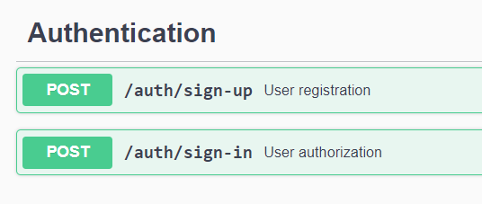
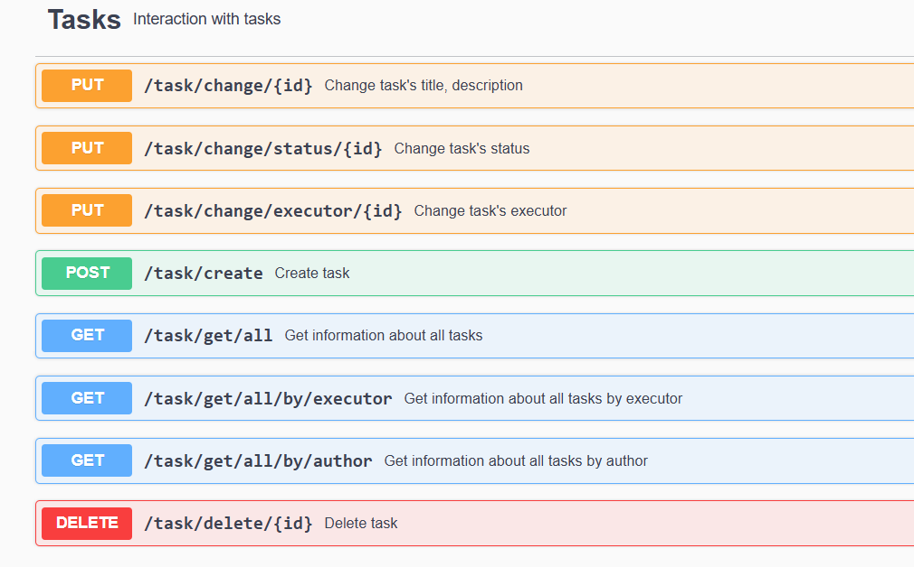
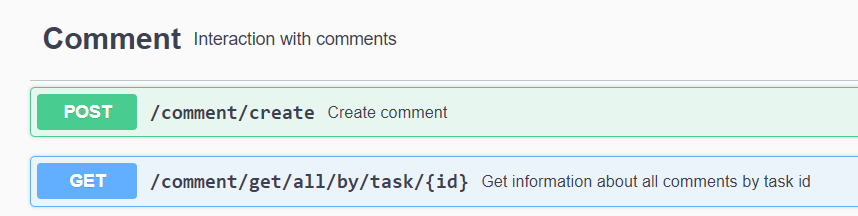

Для запуска проекта нужно:

1) скачать себе проект на локальное устройство
git clone https://github.com/Anastasiya360/management2

2) перейти в ветку dev (в ней находятся актуальные изменения)

3) запустить докер на своей локальной машине и выполнить файл docker-compose.yml (docker-compose up -d).
После этого у вас создастся контейнер с базой данных в Docker, необходимой для запуска проекта и хранения данных.

4) запускаем проект из IDE (в моем случае я запускала из Intellij IDEA)

5) При запуске проекта выполнятся flyway миграции к базе данных и создастся структура всех таблиц, использованных при разработке данного проекта.
Таблицы можно просмотреть в схеме management.

6) После запуска проекта документацию к API можно посмотреть через Swagger по ссылке http://localhost:6301/

Были реализованы:  
запросы для регистрации, авторизации пользователя

Запросы по работе с задачами

Запросы по работе с комментариями

